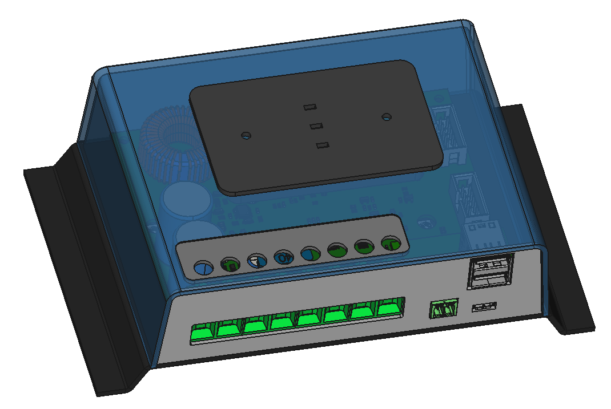

# Libre Solar MPPT 2420 HPX

 First prototype board ordered.

Schematic: [PDF file](mppt-2420-hpx.pdf) in repository

## Concept description

The **battery** port voltage can be 12V or 24V.

The **MPPT** port is connected to the battery via the DC/DC converter. This port is typically used as the solar panel input.

If building a hybrid system, the MPPT port can be used for wind generator input (after rectification) and the solar panel is connected to the **PWM** port. For a pure wind energy system, the PWM port can be used for controlling a dump load.

The **load output** protects the battery from deep-discharge if there is not sufficient power from solar panel or wind turbine. It is switched on the high-side to prevent issues with second GND paths e.g. via USB or audio cables.

## Features

- MPPT terminal
    - Max. 80V (using 100V MOSFETs)
    - DC/DC converter inductor current max. 20A, resulting in approx. 560 W maximum power for 24V systems
- Battery terminal
    - 10 V - 32 V (supporting 12 V and 24 V battery systems)
    - Max. current: 20A
- High-side load output switch
    - Max. current: 20A
- PWM input/output terminal
    - Max. current: 20A
- Fast inductor current measurement (sample rate > 300 kHz) to allow implementation of digital DC/DC control algorithms
- New STM32G431 ARM MCU with advanced digital power conversion features
- Expandable via Olimex Universal Extension Connector (UEXT)
- Peripheral power connector for power-hungry extensions like GSM boards
- Only single LED as power indicator. Additional user interface (LED gauges, displays, etc.) will be included in separate PCB in front panel housing and connected via UEXT
- Optional EXT PCB on socket in bottom right corner
    - Dual USB charging port
    - CAN interface
    - Serial interface
- Optional USB Micro B connector for firmware upgrades and settings via virtual COM port.
- Optional ESP32 module for WiFi / Bluetooth
- Optional external temperature sensor (10k NTC)

## Housing design

- MOSFETs need to be attached to an external heat sink (preliminary solution with thick aluminum sheet metal, final solution with aluminum extrusion profile)
- Panel for screw terminals and communications ports might be made from plate material to allow easy adjustment to different features.

First draft sketch of a housing with LED UI module:

